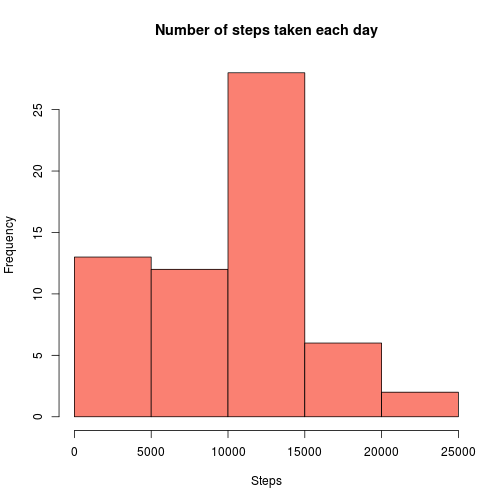
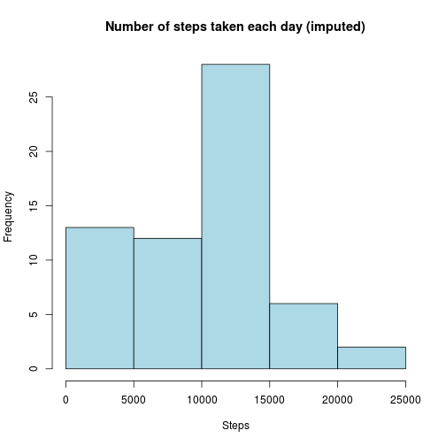
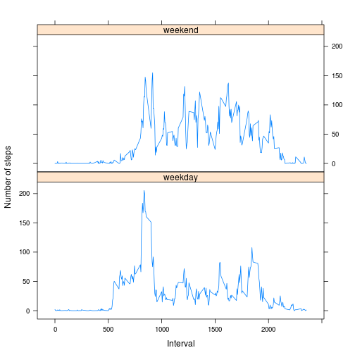

## Loading and preprocessing the data

The data are loaded from the provided zip file containing the raw step count records. The `data.table` package is used throughout this assessment. The structure and samples of the actual data are shown before any conversions. The dates are converted to proper R Date values for later processing.


```r
library(data.table)
data <- as.data.table(read.csv(unz("activity.zip", filename="activity.csv")))
# Show structure of loaded data
str(data)
```

```
## Classes 'data.table' and 'data.frame':	17568 obs. of  3 variables:
##  $ steps   : int  NA NA NA NA NA NA NA NA NA NA ...
##  $ date    : Factor w/ 61 levels "2012-10-01","2012-10-02",..: 1 1 1 1 1 1 1 1 1 1 ...
##  $ interval: int  0 5 10 15 20 25 30 35 40 45 ...
##  - attr(*, ".internal.selfref")=<externalptr>
```

```r
# Show sample of data
data
```

```
##        steps       date interval
##     1:    NA 2012-10-01        0
##     2:    NA 2012-10-01        5
##     3:    NA 2012-10-01       10
##     4:    NA 2012-10-01       15
##     5:    NA 2012-10-01       20
##    ---                          
## 17564:    NA 2012-11-30     2335
## 17565:    NA 2012-11-30     2340
## 17566:    NA 2012-11-30     2345
## 17567:    NA 2012-11-30     2350
## 17568:    NA 2012-11-30     2355
```

```r
# Convert date character strings to Date objects
data <- data[, date:=as.Date(date)]
```


## What is mean total number of steps taken per day?

The data are grouped by date and the sum of steps each day is counted. Missing values are ignored for now, and the resulting histogram with the calculated mean and median values are as follows:


```r
# Number of steps taken each day, ignoring NA's
dailysteps <- data[, .(sumsteps=sum(steps, na.rm=TRUE)), by=date][, sumsteps]
hist(dailysteps, main="Number of steps taken each day", xlab="Steps", col="salmon")
```

 

```r
# Mean and median
mean(dailysteps)
```

```
## [1] 9354.23
```

```r
median(dailysteps)
```

```
## [1] 10395
```


## What is the average daily activity pattern?

To investigate daily activity patterns, the averages of each 5 minute interval of the 61 days of the experiment are calculated. Again, the missing values are simply ignored in the calculations. 


```r
fiveminsteps <- data[, .(meansteps=mean(steps, na.rm=TRUE)), by=interval]
plot(fiveminsteps, type="l", xlab="Interval", ylab="Steps", 
     main="Average number of steps in 5 min intervals")
abline(v=fiveminsteps[which.max(meansteps), interval], col="red")
```

 

```r
fiveminsteps[which.max(meansteps)]
```

```
##    interval meansteps
## 1:      835  206.1698
```

As can be seen from the above figure, there is a clear peak between 8 and 9 in the morning, with peak average value of **206** steps at the 5 minute interval beginning at **8.35**.


## Imputing missing values

First the total number of missing values is calculated. The strategy chosen here is to replace the missing values with the median number of steps of each particular 5 minute interval throughout the whole data set. First these medians need to be calculated. Then a new column `imputedsteps` is added to the data by copying the `steps` column, and then filling in the missing values with the above counted medians. A new histogram, mean and median values of the imputed data are shown below.


```r
# Total number of NA's
sum(is.na(data$steps))
```

```
## [1] 2304
```

```r
medfiveminsteps <- data[, .(medsteps=median(steps, na.rm=TRUE)), by=interval]
data$imputedsteps <- data$steps
data <- data[is.na(steps), imputedsteps:=medfiveminsteps[interval==interval, medsteps]]
dailysteps2 <- data[, .(sumsteps=sum(imputedsteps)), by=date][, sumsteps]
hist(dailysteps2, main="Number of steps taken each day (imputed)", 
     xlab="Steps", col="lightblue")
```

 

```r
# Mean and median
mean(dailysteps2)
```

```
## [1] 9503.869
```

```r
median(dailysteps2)
```

```
## [1] 10395
```

As can be seen, there is no big difference to the previous histogram. The mean value is **slightly higher**, which was to be expected, since the missing data was replaced with median values, which are higher than the mean in this data set. The medians are **exactly the same**.

## Are there differences in activity patterns between weekdays and weekends?

To investigate any differences in activity between weekdays and weekends, the data needs to be divided in those two groups. This is done by adding a `typeofday` column in the data based on the weekdays of the observations' dates. An average plot of the step counts of each 5 minute interval is the provided for both groups:


```r
library(lattice)
data <- data[, typeofday:=ifelse(weekdays(date) %in% c("Saturday", "Sunday"), "weekend", "weekday")]
res <- data[, .(wdsteps=mean(imputedsteps)), by=.(interval, typeofday)] 
xyplot(wdsteps ~ interval | typeofday, type="l", data=res, layout=c(1, 2), 
       xlab="Interval", ylab="Number of steps")
```

 

As can be seen from the figure above, there is a notable difference in the activity patterns. At weekends the activity is **more evenly spread out** during day time than on weekdays, where there is a **peak in the morning**.
